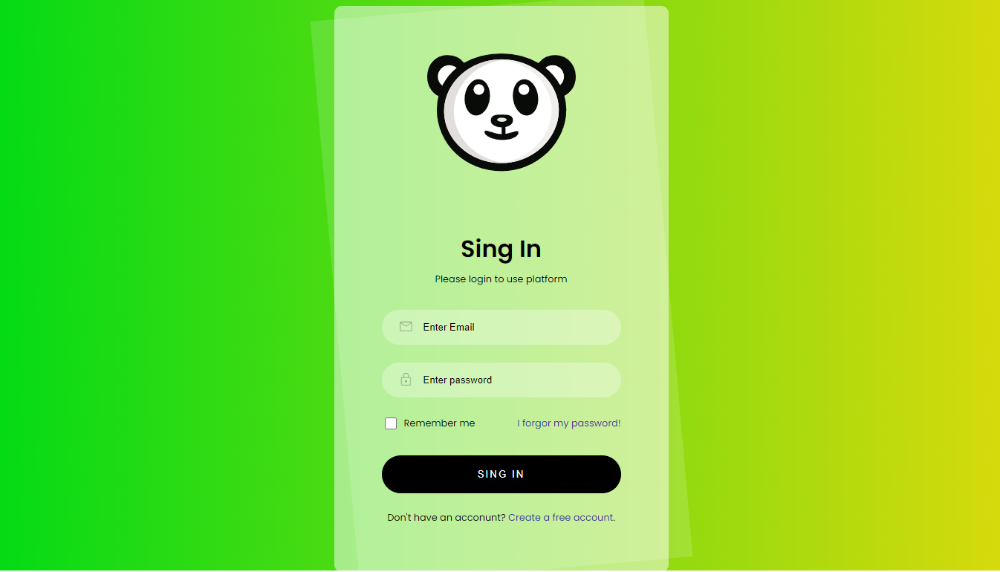

# Login glass

login semitransparente, como práctica para la parte de CSS y esqueleto HTML, el cual se hizo uso de *linear-gradient*, *before*, *z-index* y llamada de *font-family* tomada de la web para estilo a la letra.

Se hizo uso de *linear-gradient* en el body para la mezcla de un verde y amarillo:

```CSS
body{
background: linear-gradient(to right, #04db15, #d6da0c);
}
```
Así como uso de *before* en la parte del *login-card* para generar uno igual con una rotación de -5 grados y que este se posicione -1 de la posición Z:
```CSS
.login-card::before{
    content: '';
    position: absolute;
    background: rgba(255, 255, 255, 0.15);
    inset: 0;
    transform: rotate(-5deg);
    z-index: -1;
}
```


[Link](https://hydr0bius.github.io/login-glass/) de la página


De igual modo se uso un resert.css llamado desde del CSS:

```CSS
@import url(reset.css);
```

Así como el llamado de una fuente tomada de internet para usar en el *font-family*:
```CSS
@import url('https://fonts.googleapis.com/css2?family=Amatic+SC&family=Poppins:wght@400;600&display=swap');
body{
    font-family: 'Poppins', sans-serif;
    }
```
